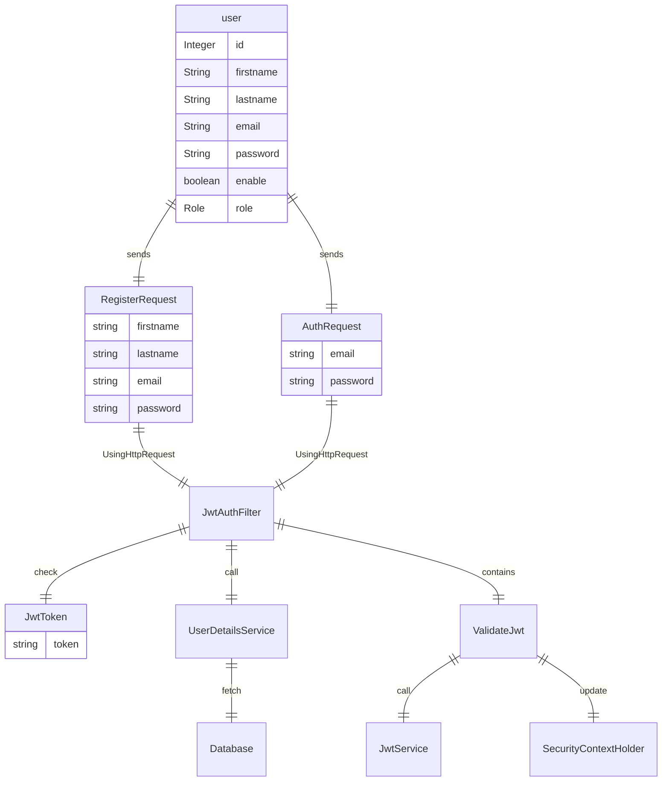

<h1>User service</h1>

This Service is a Registration and a validation system. The Backeend of the system was built using Spring Boot utilizing  Spring Security, and JSON Web Tokens (JWT), the frontend of the system was built using Angular.
The journey of the validation process begins when a user sends a RegisterRequest to register, or an AuthRequest to Authenticate as an HttpRequest to the JwtAuthFilter. The JwtAuthFilter is a once per request filter, and it has the role to check and validate everything regarding the JwtToken.
 First, the JwtAuthFilter will check if the JwtToken is available or missing. If JwtToken is missing, a 403 response will be sent to the user saying 'Missing JwtToken'.
Second, the JwtAuthFilter will call the UserDetailsService to fetch the user information from the Database, and this is based on the AuthRequest which the user has sent. Once the user is fetched, and if the user is missing, a 403 response will be sent the user saying 'user does not exist'.
Once the user is found with a generated Token, the validation process will start by validating the JwtToken using the ValidateJwt mechanism. The ValidateJwt mechanism will call the JwtService which takes the user information and the token. After the execution of the validation process, there will be two cases.
 The first case, which the token is not valid, a 403 response will be sent to the user saying 'Invalid Jwt Token'. The second case if the Token is valid then the SecurityContextHolder will be updated informing the user is authenticated.

 <h2>Features</h2>
 <ul>
  <li>Password Encoder: Users passwords are encrypted inside the Database.</li>
  <li>JSON Web Tokens (JWT): After successful authentication, admins receive a JWT that can be used to access protected resources.</li>
  <li>Authentication: Admin can activate or deactivate users after authentication.</li>
 </ul>

